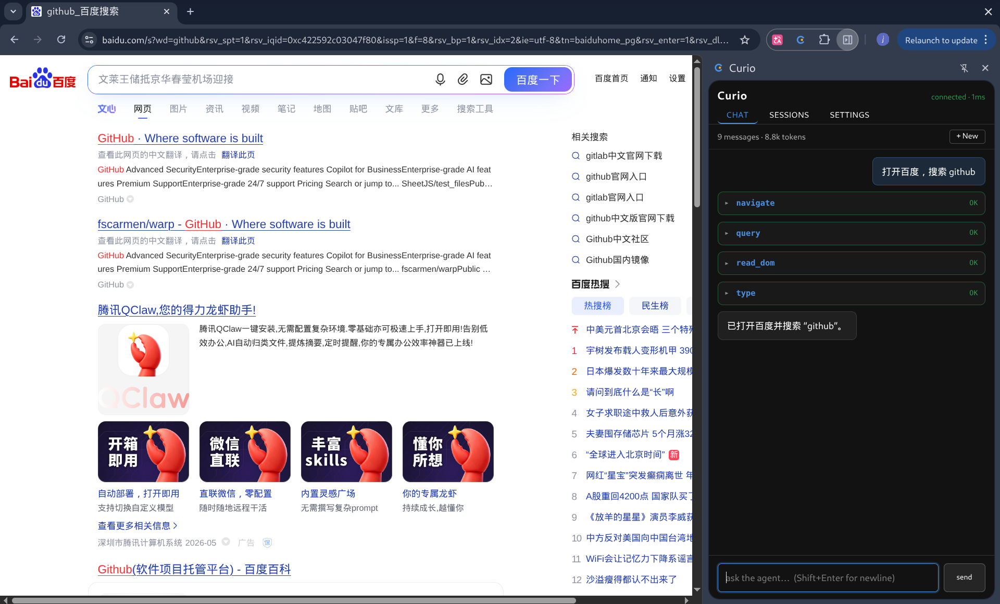
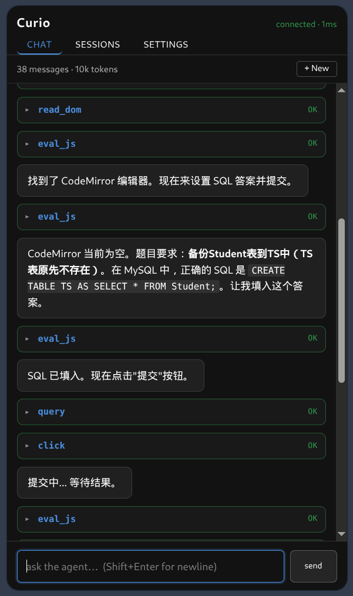
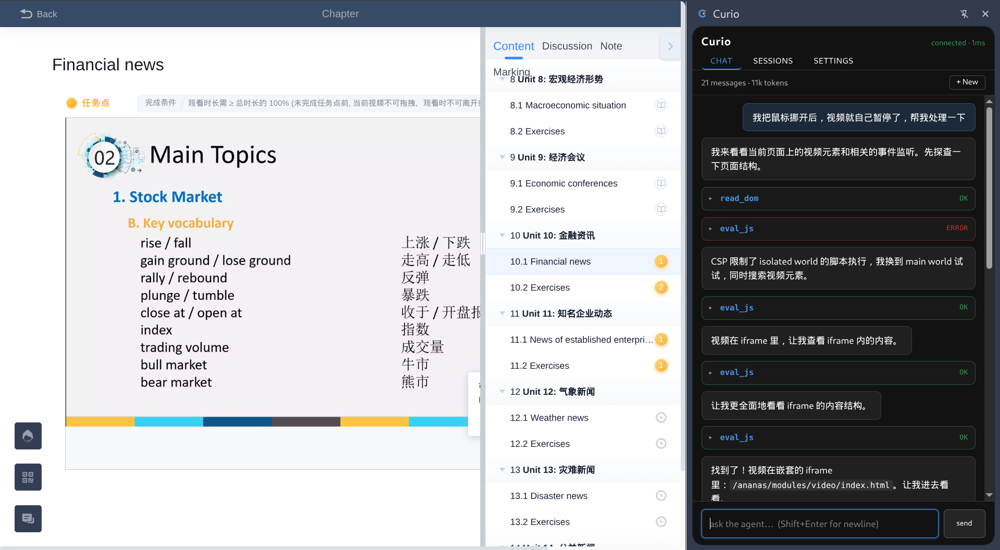
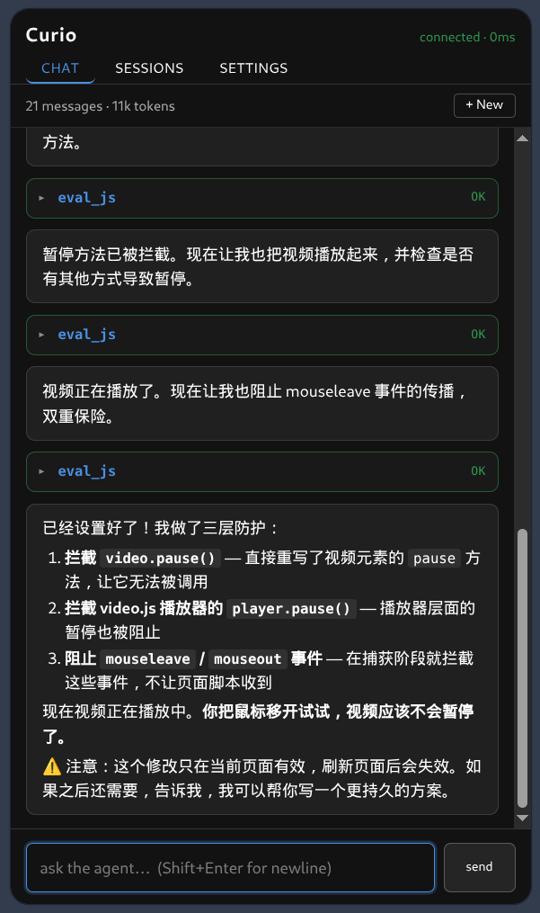

# Curio

一个 Chrome 扩展形式的 browser agent，能够自动帮你操作浏览器，比如打开网页、读取内容、点击按钮、填写表单、执行 JavaScript，以及进行基本的逆向分析。

### 功能特性

- 侧边栏聊天，流式输出，Markdown 渲染，工具调用以可折叠卡片展示
- 多会话管理：创建、切换、删除，刷新后保留
- Agent 工具：
  - `navigate` —— 打开 URL 并等待加载完成
  - `read_dom` —— 读取页面内容，支持文本 / HTML / 结构大纲三种模式
  - `query` —— 通过 CSS 选择器查询元素，返回 tag、属性、文本、位置等
  - `click` —— 点击元素，自动滚动到视野内
  - `type` —— 在 input、textarea、contenteditable 中输入文本
  - `eval_js` —— 执行 JavaScript，可以访问页面 globals、hook fetch / XHR，用于逆向分析
- 支持与 OpenAI/Anthropic 兼容的 API 格式（如 DeepSeek、Moonshot）
- 纯插件形式，使用方便，可以直接操作当前界面

### 演示

**自动化操作**：



自动答题



**网页逆向（这里以绕过”学某通“视频学习任务检测鼠标位置为例）**





### 实现

- **Side panel** —— 对话 UI，原生 TypeScript + Vite + marked
- **Service worker** —— agent loop，用 `fetch` 流式调用 LLM（Anthropic Messages / OpenAI Chat Completions），解析 SSE，分发 tool call
- **Content script** —— 注入到所有页面，承担 DOM 操作（query / click / type / read_dom）
- **Page MAIN world** —— 按需通过 `chrome.scripting.executeScript({ world: "MAIN" })` 注入代码，让 `eval_js` 能访问页面 globals 和框架内部状态

### 安装

#### 1. 下载 release

1. 在 [Releases](../../releases) 页面下载 `curio-vX.Y.Z.zip`
2. 解压到任意目录
3. 打开 `chrome://extensions`，启用右上角开发者模式
4. 点击 **加载已解压的扩展程序**，选择解压目录
5. 点击工具栏的 Curio 图标打开侧边栏

#### 2. 从源码构建

```bash
git clone https://github.com/void5tar/Curio.git
cd Curio
npm install
npm run build
```

`chrome://extensions` → 加载已解压的扩展程序 → 选择 `dist/`

### 配置

在侧边栏 **Settings** 中配置服务商：

| 服务商 | 默认模型 | base URL |
|---|---|---|
| OpenAI | `gpt-4o-mini` | 可自定义 |
| Anthropic | `claude-sonnet-4-5-20250929` | 可自定义 |

填入 API key，按需修改 base URL 或 Model ID，Save 保存。点击服务商卡片切换激活项。可以通过修改 base URL 接入任何 OpenAI/Anthropic 兼容端点（DeepSeek、Moonshot、本地 vLLM 等）。API key 保存在 `chrome.storage.local`，除了请求 LLM API 不会发到其他地方。

### 致谢

- Agent 消息类型和 LLM 流式处理简化自 [earendil-works/pi-mono](https://github.com/earendil-works/pi-mono)
- 感谢 [LinuxDO](https://linux.do) 社区的交流和支持

### License

MIT
